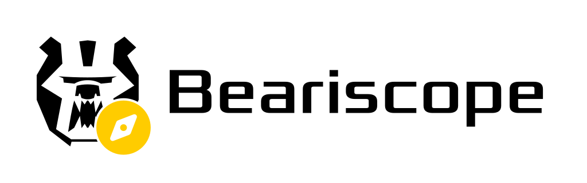

  

  <b>The ultimate FRC strategy app</b>

  
  
  

> [!IMPORTANT]
> This specific repo has been archived. All code has been moved to our monorepo [bearings](https://github.com/bear-metal-2046/bearings).
---

Beariscope is a FRC strategy app by Team 2046, Bear Metal.

## Features

- **Team Lookup** - view any team's scouting data across averages, hardware capabilities, match-by-match breakdowns, and written notes
- **Match previews** - swipe through all 6 robots in an upcoming match
- **Up Next** - a full event schedule with current and past matches
- **Pits scouting** - fill out pit forms directly in the app, with both a list view and an interactive pit map pulled from Nexus
- **Cloud sync** - all scouting data lives in the cloud
- **Role-based access** - different permissions for scouts, strategists, and drive team
- **Mobile, desktop, and web!** - works on iOS, Android, your laptop, and as a web app in a pinch

## If you haven't checked out our..
- [Scouting App](https://github.com/bear-metal-apps/pawfinder)
- [Shared Library](https://github.com/bear-metal-apps/libkoala)
